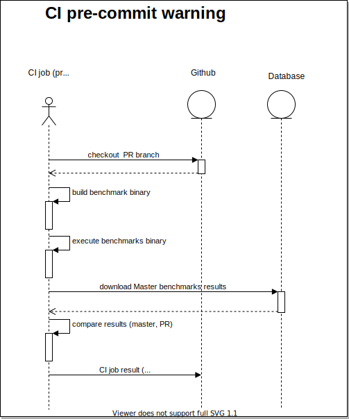
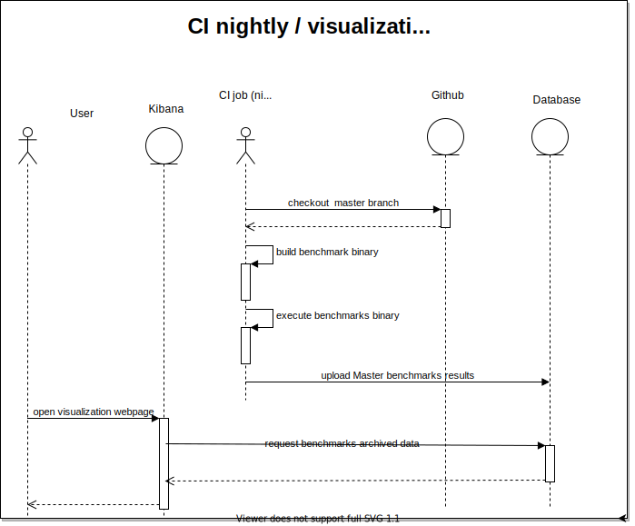

# Operations benchmarking POC

## Problem
Engineers working on operation performance do not have a common way to measure and quantify performance. Different tools are used (VTune, gbenchmark, ad hoc solutions) or performance is not mesured at all.
## Proposal
- **produce Operations Performance Indicator (OPI) per each operation implementation (per OpenVINO plugin)** - the idea is to have simple metric for distinc op performance (not "100" measurements which will be hard to draw meaningfull conclusions from)
- **produce CI pre-commit job with warning about performance degradation** - it will enable us to detect early unintended performance degradation
- **[optional] produce weekly OPI report** - it will provide textual view on operations performance on week to week basis  
- **[optional] visualize OPI trend in master over time** - it will provide graphical view on operations performance in longer time period

## Users
- Intel engineers working on OpenVINO operations performance (private access)

## Benefits
- Engineers working on performance optimizations will have standarized way to quantify performance improvements for distinct operations
- Automated CI checks to detect performance degradation
- [optional] reporting & visualization will enable us to understand long-term trend of operation performance

## IE infrastructure code (variant 1)
 [This](https://github.com/openvinotoolkit/openvino/pull/6325) approach is based on cmake target intruduction which will build new benchmarks binary. Implementation is based on [Google Benchmark](https://github.com/google/benchmark) library which is mature off-the-shelf product.
### Pros
- google benchmarks is well tested, which mean less bugs in 'infrastructure' code
- google benchmarks has copmprehensive [documentation](https://github.com/google/benchmark#user-guide), which mean easy onboarding for new engineers
- google benchmarks ships additional [compare tools](https://github.com/google/benchmark/blob/main/docs/tools.md) which enable easy comparison of different versions of benchmarks (handles well all of the edge cases, e.g. benchmark present in one version but not the other)
- easy to understand what is actually mesured, input tensors & op attributes are explicitly stated in benchmark code
- PR to IE with benchmark infrastructure code can be quickly introduced to master (not much to develop here as all of the heavy lifting is done by gbenchmark) and individual benchmarks can be introduced as part of Reference Implementations Review epic.
- cross-platform support out of the box
### Cons
- benchmarks code need to be written from scratch for every operation
### Usage:
```bash
cmake .. -DCMAKE_BUILD_TYPE=Release -DENABLE_TEMPLATE_PLUGIN=ON -DENABLE_OP_BENCHMARKS=ON 
cmake --build . --target op_benchmarks
./op_benchmarks --benchmark_repetitions=10 --benchmark_display_aggregates_only --benchmark_out_format=json --benchmark_out=approach1_results.json

2021-06-22T13:23:32+02:00
Running ./inference-engine/tests/op_benchmarks/bin/op_benchmarks
Run on (96 X 2394.38 MHz CPU s)
CPU Caches:
  L1 Data 32 KiB (x96)
  L1 Instruction 32 KiB (x96)
  L2 Unified 1024 KiB (x96)
  L3 Unified 36608 KiB (x96)
Load Average: 0.06, 0.20, 0.34
---------------------------------------------------------------------------------------------
Benchmark                                                   Time             CPU   Iterations
---------------------------------------------------------------------------------------------
convolution_2D_reference_mean                            8444 us         8443 us           10
convolution_2D_reference_median                          8427 us         8427 us           10
convolution_2D_reference_stddev                          54.0 us         52.7 us           10
convolution_2D_plugin<DeviceType::TEMPLATE>_mean         7360 us         7360 us           10
convolution_2D_plugin<DeviceType::TEMPLATE>_median       7332 us         7331 us           10
convolution_2D_plugin<DeviceType::TEMPLATE>_stddev       78.0 us         77.9 us           10
convolution_2D_plugin<DeviceType::CPU>_mean               619 us          618 us           10
convolution_2D_plugin<DeviceType::CPU>_median             613 us          612 us           10
convolution_2D_plugin<DeviceType::CPU>_stddev            21.5 us         21.4 us           10

```
### Naming convention
Benchmarks names should follow name convention to be able to run specific subset of tests in CI (e.g. slow benchmarks shouldn't be executed in pre-commit). Naming convention follows what is in use in SLTs. 
#### Fast benchmarks
Fast benchmarks should execute in less than 30 seconds.

Name template: **smoke_OperationName_Version_BenchmarkDetails**   
Example: *smoke_Convolution_1_InputShape1x1x32x32*
#### Slow benchmarks
Slow benchmarks do not meet 'fast benchnmarks' speed criteria.

Name template: **nightly_OperationName_Version_BenchmarkDetails**  
Example: *smoke_Convolution_1_InputShape1x1x1024x1024*  
### Resources:
- [Code](https://github.com/openvinotoolkit/openvino/pull/6325)
- [Results JSON](approach1_results.json)
- [Results TXT](approach1_results.txt)


## IE infrastructure code (variant 2)
[This](https://github.com/openvinotoolkit/openvino/pull/5122) approach is based on cmake flag intruduction which will build pluginFuncTests (and similarily template and other plugins) binary with benchmarking code enabled. Implementation is based on measuring inference time off all executed tests and preprocessing the output as a next step via seperate custom script to get the Single Perfornamce Indicator per operation (we don't want to present to the user so many benchmarks results as it is impossible to draw some meaningfull conclusion from this data).
### Pros
- benchmarks for all operations which has SLTs generated for 'free'
- this approach is similiar to what OpenCV does, which can by familiar to some of the engineers
### Cons
- SLTs are written mostly with small inputs which can give missleading results (e.g. for small inputs Convolution ref impl performs better than CPU plugin). To fix that we would need to rewrite these tests which points us back to *Variant 1*.
- benchmarking & statistical analysis can be tricky to implement correctly, high risk of subtle bugs
- it will be very hard to understand what actully mesurements represents, because there is no single benchmark to look at, but rather statistical analysis of many automatically generated tests results
- need to develop compare tool
- need to change SLTs infrasturcure code - PR can be time consuming
- there is no isolation between SLTs and benchmarks, any change in SLTs (e.g. new tests added) can affect benchmarks results which can be hard to explain/understand at first sight
### Usage:
```bash
cmake .. -DCMAKE_BUILD_TYPE=Release -DENABLE_TEMPLATE_PLUGIN=ON -DENABLE_TESTS=ON -DPERFORMACE_BENCHMARK=ON 
cmake --build . --target cpuFuncTests

# produce raw benchmark data
./cpuFuncTests --gtest_filter=*smoke_Convolution2D*

Note: Google Test filter = *smoke_Convolution2D*
[==========] Running 248 tests from 4 test cases.
[----------] Global test environment set-up.
[----------] 192 tests from smoke_Convolution2D_ExplicitPadding/ConvolutionLayerTest
...

cat vino_benchmark.log 
test_name,execution_number,execution_time_-_microseconds
smoke_Convolution2D_ExplicitPadding/ConvolutionLayerTest/CompareWithRefs_IS__1_3_30_30__K_3_3__S_1_1__PB_0_0__PE_0_0__D__1_1__O_1_AP_explicit_netPRC_FP32_inPRC_UNSPECIFIED_outPRC_UNSPECIFIED_inL_ANY_outL_ANY_trgDev_CPU,100,"2644,2200,2427,2082,1431,1879,2509,1265,3134,958,1156,200,453,572,960,796,291,532,910,1522,428,177,671,1033,482,986,1083,428,461,1206,342,220,414,790,873,410,246,857,768,172,266,185,229,251,178,228,280,882,178,300,357,205,319,143,912,332,105,148,143,119,100,149,212,94,496,596,460,537,132,385,185,666,1078,223,1029,463,975,741,376,127,214,468,1349,159,483,490,466,115,89,936,231,572,694,211,546,555,101,241,129,513"
...

# preprocess raw benchmark data
python read_csv.py -i vino_benchmark.log > preprocessed_vino_benchmark.txt
cat preprocessed_vino_benchmark.txt
/home/jdanieck/patryk_bench_poc/openvino/build/vino_benchmark.log
Opening:  /home/jdanieck/patryk_bench_poc/openvino/build/vino_benchmark.log
For smoke_Convolution2D/ConvConcatSubgraphTest/CompareWithRefs_Type_Convolution_IS__1_64_16_16__K_3_3__S_2_2__PB_1_1__PE_1_1__D__1_1__O_32_G_1_AP_explicit__inFmts_cpu_nChw16c_outFmts_cpu_nChw16c_primitive_jit_avx512_axis_1 (exec no: 100)  stat: (min 94, max 2509, mean 597.3645833333334, median 460.5):
...
```

### Resources:
- [Results](approach2_results.csv)
- [Preprocessed results](approach2_preprocessed_results.txt)
- [Code](https://github.com/openvinotoolkit/openvino/pull/5122)
- [Preprocessing script](https://gitlab.devtools.intel.com/pelszkow/openvino-slt-benchmark-poc)


## CI implementation
**This part was not POC yet**. To be done when decided which IE benchmarking infrastructure implementation variant is the "winner".

### pre-commit warning
Why warning and not error?
- we can conciously decide that we want some change which will degrade performance - it is OK, the point is to avoid **unintended** performance degradation, so we should allow merge in this case
- doing 'benchmarking' is tricky, espacially in CI where we are not sure if benchmarks where executed in the same conditions every time (e.g. the same machine, no external CPU load), so in case of flagged PR human should review and decide if this is a real issue

Assumptions:
- it is costly to build benchmarks target; hence we will cache benchmarks results from master branch to not build it on every pre-commit

To be considered
- what technology use for Datastore (shared filesystem? database?)
- backup policy for Datastore
- how to schedule CI job so we have repeatable benchmark results; ideally it would be dedicated machine
- should this job be triggered automatically on every PR or on users request



### [optional] weekly OPI report / OPI trend visualization
Additional optional improvements are *weekly reports* and *visualization*. Weekly reports are already a practice in OpenVINO so it could be extended to include also operations benchmarks. Visualization of metrics is to be developed from scratch as there is no such solution present (at least the author is not aware of it).

[Kibana](https://www.elastic.co/kibana)/[Elasticsearch](https://www.elastic.co/elasticsearch/)* is proposed as a out of the box solution to provide metrics visualization. It could be also used in the future to visualize other metrics, e.g. ngraph library size over time. The caveat is that it is a complex tool to learn so it's usage should be evaluated in the context of devops team skillset (assuming they will implement it). Other similiar tools also exist and could be used insetad, the point is to use some out-of-the-box solution.   

**Kibana/Elasticsearch basic functionality is free of charge. I've consulted with colleague from VPU Validation and they have production experience with this tool so we can borrow BKMs from them.*

### To be considered
- which Visualization tool is going to be used, Kibana or some other tool?
- how to manage access to Visualization tool
- how to deploy Visualization tool ? hosted in devops lab (no costs) or IT provided service (paid) ?
- do we need some additional preprocessing scripts to adjust data for visualization / reporting




